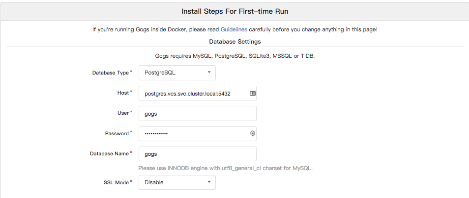
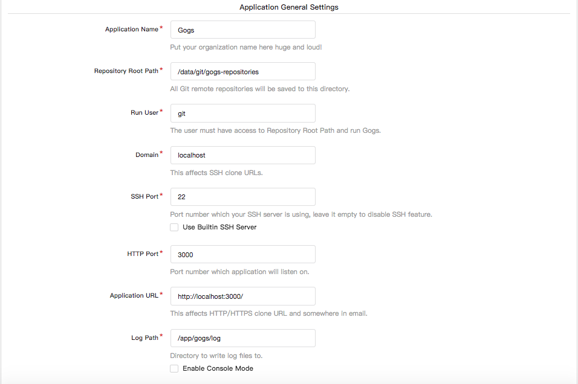

# Gogs deployment with Postgres

If you don't have a Kubernetes cluster to work with yet, check out my [local-kubernetes-bootstrap](https://github.com/stevenaldinger/local-kubernetes-bootstrap) repo to get started.

[Gogs is a painless self-hosted Git service.](https://github.com/gogits/gogs/tree/master/docker) https://gogs.io

[PostgreSQL is an advanced object-relational database management system that supports an extended subset of the SQL standard, including transactions, foreign keys, subqueries, triggers, user-defined types and functions.](https://github.com/postgres/postgres) https://www.postgresql.org/

# TODO:

1. Using a `secret` to set the `gogs` database password makes login fail for some reason. For the time being the password is just deployed in a `configmap`, although this is insecure.
2. Using proper `readinessProbe` on postgres container always fails with: `FATAL:  role "root" does not exist`

# Deploying Gogs and Postgres

`kubectl apply -f ./k8s`

## Wait until everything is up and running

`while :; do kubectl get svc,rc,po,deploy,statefulset,secrets,configmaps --all-namespaces; kubectl get pv; sleep 5; done`

## Port forwarding

Once the pods are created, you can forward the `gogs` ports and view `gogs` in your browser.

`kubectl port-forward gogs-0 -n vcs 3000:3000 2222:22`

Navigate to `http://localhost:3000/install` to begin configuring your new `gogs` server.

## Drone Integration

Be sure to make a user with username `drone` and password `dronepass` if you'll be deploying the k8s-drone project with `gogs` and don't want to alter the `drone` secret.

## Viewing logs

`kubectl logs -f postgres-0 -n vcs`

`kubectl logs -f gogs-0 -n vcs`

# Create a secret

To encode a password for use with a secret you can run:

`echo gogspassword | base64`

# Changing the gogs database password

If for any reason you want to change the `gogs` database password you can do so with this command:

`kubectl exec postgres-0 -n vcs -- bash -c "psql -U gogs -d gogs -c \"ALTER USER gogs WITH ENCRYPTED PASSWORD 'gogspassword'\""`

This writes the plain text password to `.psql_history` and should be deleted to be extra safe.

`rm ~/.psql_history`
